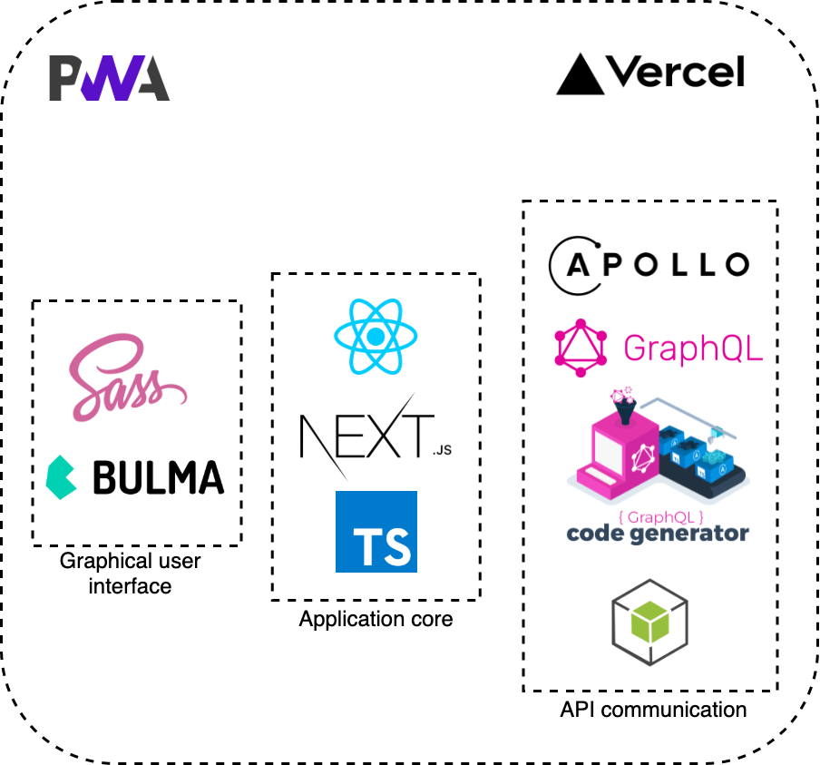
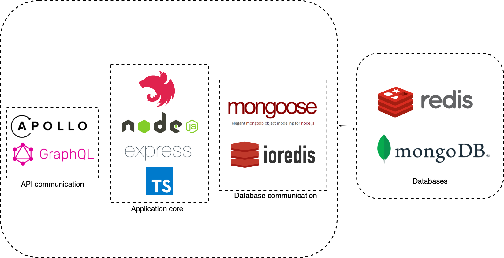

<h2 align="center">Authela</h2>
<h3 align="center">two-factor authentication system</h3>

## The goal

The main goal is to implement a two-factor authentication system. The created application include GUI that allows you to create accound and log in to it through the created two-step authentication system. The user will have to enter the password in the graphical interface, then user will be asked to scan the QR code with his smartphone with external app (e.g. "Google Authenticator") and enter the generated  token. If the provided token is correct, the user will be able to access the application.
Additionally, when creating an account, an e-mail will be sent with a request to activate the account to the address provided. The user will also have access to delete his account, reset, change the password or other own data.


### Used technologies
The technological stack of the system was selected taking into account skills, knowledge of programming environments and design requirements.

* Backend:
  * `Nest.js`
  * `Typescript
  * `Apollo Server`
  * `Mongoose`
  * `MongoDB`
  * `Redis`
* Frontend:
  * `Next.js`
  * `Typescript`
  * `Apollo Client`
  * `GraphQL Code Generator`
  * `SASS`
  * `Bulma`
* Cloud:
  * `AWS S3`
  * `Code Pipeline`
  * `EC2`

### Build and setup

Frontend

* development:

```
cd frontend
cp .env.example .env
npm install
npm run dev
```

* build:

```
cd frontend
npm ci
npm run build
npm run start
```

Backend:

* development:

```
cd backend
cp .env.example .env
npm install
npm run start:dev
```

* build:

```
cd backend
npm ci
npm run build
npm run start
```

### Application architecture

Frontend architecture :



Backend architecture :



### PWA

To disable PWA replace `process.env.NODE_ENV` to `development`.
